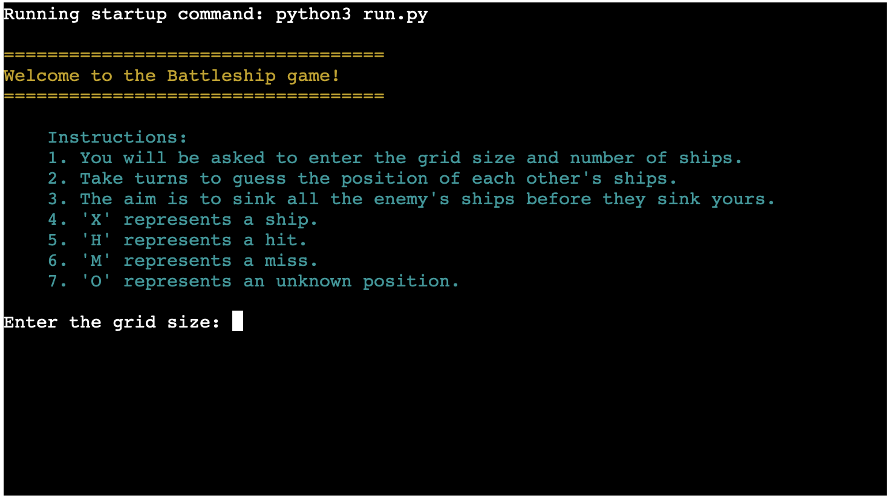
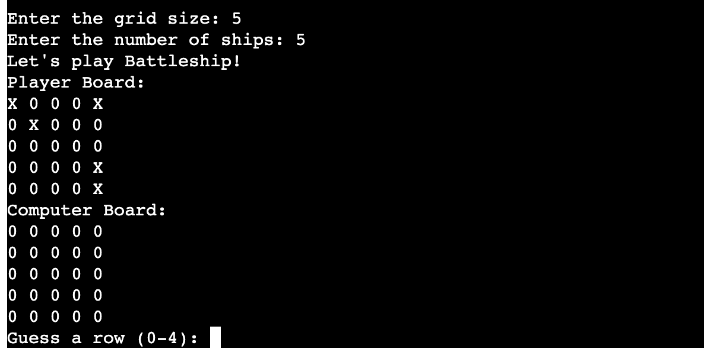
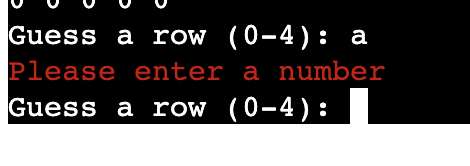
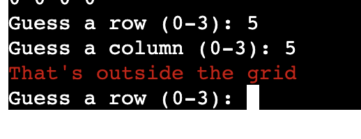
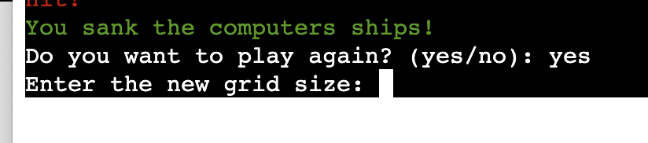
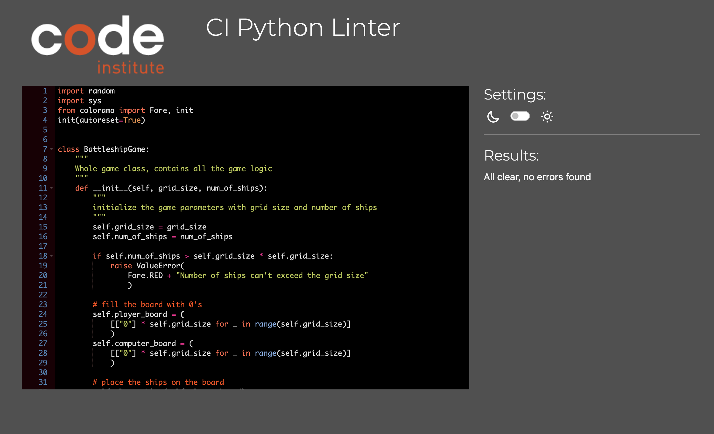

# **Battleship**

Welcome to the Battleship game! This console-based game allows you to customize the grid size and the number of ships, each with a size of 1. You will face off against the computer, which will randomize its attacks. Your mission is to sink all of the computer's ships before it sinks yours.
A live version of the project can be viewed [Here](https://battleshipgame1-e369fc9fbecc.herokuapp.com/).

## Table of Contents

1. [**Battleship**](#battleship)
   * [How to Play](#how-to-play)
     * [Setup](#setup)
     * [Placing Your Ships](#placing-your-ships)
     * [Scoring](#scoring)
     * [Winning the Game](#winning-the-game)
   * [Game Rules](#game-rules)
   * [Customization](#customization)
2. [**User Experience (UX)**](#user-experience-ux)
   * [User Stories](#user-stories)
   * [Site Goal](#site-goal)
3. [**Features**](#features)
   * [App Title and Main Menu](#app-title-and-main-menu)
   * [Initialization of the Game](#initialization-of-the-game)
   * [Displaying the Board](#displaying-the-board)
   * [Placing Ships](#placing-ships)
   * [Gameplay](#gameplay)
   * [Input and Validation](#input-and-validation)
   * [Replaying the Game](#replaying-the-game)
   * [Colored Output](#colored-output)
   * [Features Left to Implement](#features-left-to-implement)
4. [**Technologies and Libraries Used**](#technologies-and-libraries-used)
5. [**Testing**](#testing)
   * [Testing during development](#testing-during-development)
   * [Bugs Found](#bugs-found)
   * [Functional Testing](#functional-testing)
   * [Validator Testing](#validator-testing)
6. [**Deployment**](#deployment)
   * [Version Control](#version-control)
   * [To deploy to Heroku terminal](#to-deploy-to-heroku-terminal)
   * [Clone the Repository Code from github desktop](#clone-the-repository-code-from-github-desktop)
7. [**Credits**](#credits)

## How to Play

Battleship is a turn-based strategy game where you and the computer take turns to make attacks on each other's grids. Your goal is to sink all of the computer's ships before it sinks yours.

### Setup

You can choose the grid size when starting the game (e.g., 5x5, 7x7, etc.).
You can also set the number of ships on the grid. In this version, all ships have a size of 1.

### Placing Your Ships:

At the beginning of the game, your ships are automatically placed on the grid. You don't have control over ship placement in this version.
Taking Turns:

You and the computer take turns attacking each other's grids.
You will be prompted to enter the row and column for your attack.
The computer's attacks are randomized.

### Scoring

If your attack hits a computer's ship, you will be informed that you've hit the target.
If your attack misses, you will be informed that you've missed.

### Winning the Game

Continue taking turns until you or the computer have sunk all of the opponent's ships.
The first player to sink all opponent's ships wins the game.
Game Over:

Once the game is over, you will be notified of the result (win or lose), and you can choose to play again.

## Game Rules

* The rules of the Battleship game are simple:

* Instructions:
    1. You will be asked to enter the grid size and number of ships.
    2. Take turns to guess the position of each other's ships.
    3. You can guess a position by entering the row and column number
    where 0 is the first row/column.
    4. The aim is to sink all the enemy's ships before they sink yours.
    5. 'X' represents a ship.
    6. 'H' represents a hit.
    7. 'M' represents a miss.
    8. '0' represents an unknown position.

## Customization

You can customize the game in the following ways:

**Grid Size:** You can choose the size of the grid at the beginning of the game. Larger grids provide a more challenging game.

**Number of Ships:** You can set the number of ships on the grid. In this version, all ships have a size of 1.

## User Experience (UX)

### User Stories

* As a player, I want to be able to customize the grid size and the number of ships at the beginning of the game so that I can tailor the game to my desired level of challenge.
* As a player, I want to see a clear representation of my grid and the computer's grid so that I can strategize my attacks effectively.
* As a player, I want to be prompted to enter my attacks using a user-friendly format so that I can easily input my moves.
* As a player, I want to receive feedback after each of my attacks to know whether I hit or missed the target.
* As a player, I want to know when I have successfully sunk all of the computer's ships so that I can celebrate my victory.
* As a player, I want to have the option to play the game again after it's over, so I can have multiple rounds of fun.
* As a player, I want the computer's attacks to be randomized to add an element of unpredictability to the game.
* As a player, I want the game to have clear win/lose conditions and to receive a message indicating the game's outcome.

### Site Goal

* This App was designed based on user stories to provide the best dynamic experience.
* User Inputs are designed **NOT** case-sensitive. No matter what case the user types in, the outcome of the answer remains the same.
* Colored text and formatted grids for a better site readability and user friendly interface.

## Features

### App Title and Main Menu

* Yellow text welcomes the user to the game.
* Number listed instructions on how to play are provided in magenta color
* A clear message prompts the user to start the game by choosing the size of the grid.

* If users didn't enter the correct type of input required by the instruction message (eg: anything rather than digits), an error message written in red color appears.
* Users will be prompted to write an input again until the expected type of input is entered.

* When Entering a number outside of the grid

### Initialization of the Game

The game board can have a user-defined grid size.
The number of ships is also decided by the player during initialization.
There's a check to ensure the number of ships doesn't exceed the grid size.
Both the player and the computer have their own board, initialized with '0's, which represent unknown positions.

### Displaying the Board

The player's board is displayed as-is.
The computer's board is displayed with 'X's (ships) replaced by '0's to hide the ship positions from the player.

### Placing Ships

Ships (represented by 'X') are placed randomly on the board.
The code ensures that ships don't overlap.

### Gameplay

* Players take turns guessing the row and column where they think the opponent's ships are located.
* If a player hits a ship, the board position changes to '**H**' indicating a hit.
* If a player misses, the board position changes to 'M' indicating a miss.
* The game continues until all ships of one side are sunk.

### Input and Validation

* The game prompts the user to input the grid size and number of ships.
* There are checks to ensure the entered values are valid and appropriate error messages are displayed otherwise.

### Replaying the Game

* After a game finishes, players are given an option to play again.
* If they choose to play again, they can redefine the grid size and number of ships for the new game.

### Colored Output

The game uses the colorama library to display colored output to enhance the user experience and make errors more noticeable.

### Features Left to Implement

* The possibility to write coordinates in the A1, B2 format if the user prefers so.
* Multiplayer option for the game.
* The possibility to restart the game at any point.
* Different sizes of the ships

## Technologies and Libraries Used

* Python was used as the programming language to code the game logic.
* [Colorama](https://pypi.org/project/colorama/) to add Color
* [GitHub](https://github.com/) has been used to store the code, images, and other content related to the project.
* [Heroku](https://dashboard.heroku.com/apps) was used to deploy the game on the web.
* [Git](https://git-scm.com/) was used to commit and push code during the development stage.
* [Visual Studio Code](https://code.visualstudio.com/) was used as an IDE.

## Testing

### Testing during development

* Continuous testing was carried out throughout the development stage and even after the deployment.
* `print()`and `type()` were used during the development process, to help identify possible errors and bugs.
* All the prompts to the user were tested manually.

### Bugs Found

* It is possible to input the digit `0` when prompted to choose the size of the grid, this resulted in a non-existing grid but the game continued to prompt the user to input the number of ships. This could fixed in the future by adding `0` as a `ValueError` condition when validating the input.

* The input `0` is valid when choosing the number of ships to play with. This becomes an error in the game logic resulting in the player immediately losing the game.  This could fixed in the future by adding `0` as a `ValueError` condition when validating the input.

* When the game is completed and user gets asked for a second round, if yes: By entering for example 0 ships the game quits instead...
And when saying no, the game freezes.

### Functional Testing

After the game was deployed on Heroku at the end of the development stage, a dedicated manual testing was carried out as a user at Heroku terminal. Each input option was tested with all the possible scenarios and particular attention was paid to validating the value of the input. The player's board as well as the computer's board were closely monitored to check if any changes were made as a consequence of the guesses made on each round.

Here are the results:
| Purpose                                    | Action                                | Expected                                         | Result |
| ------------------------------------------ | ------------------------------------- | ------------------------------------------------ | ------ |
| Enter grid size                            | Enter a number                        | Create the game grid                             | PASS   |
| Enter amount of ships                      | Enter a number                        | Fills the board with the amount of entered ships | PASS   |
| Guess a row                                | Enter a number according to grid size | Input number is saved                          | PASS   |
| Guess a col                                | Enter a number according to grid size | The numbers entered will be marked on the grid   | PASS   |
| Entering a larger number than the grid     | Enter a number higher to grid size    | Error message "That's outside the grid"          | PASS   |
| Hit or miss a ship                         | Enter the right or wrong row and col  | Message should appear Miss or Hit                | PASS   |
| Play the game again when round is finished | Enter Yes                             | Game restarts                                    | PASS   |
| Play the game again when round is finished | Enter No                              | Game quits                                       | FAIL   |
| To get the right information               | Enter a letter                        | Error message "Please enter a number"            | PASS   |

### Validator Testing

[pep8](https://pep8ci.herokuapp.com) was used for validating the python files.  No errors reported.

## Deployment

### Version Control

*   Git was used as the version control software. Commands such as git add ., git status, git commit and git push were used to add, save, stage and push the code to the GitHub repository where the source code is stored.

### To deploy to Heroku terminal

The site was deployed via [Heroku]( https://id.heroku.com/login).
This project was developed utilizing the [Code Institute Template]( https://github.com/Code-Institute-Org/python-essentials-template).

`pip3 freeze > requirements.txt` was used to add Colorama imports to Heroku for deployment.

The below steps were followed to deploy this project to Heroku:
1. Go to [Heroku](https://dashboard.heroku.com/apps) and click "New" to create a new app.
2. Enter your App name, set the region, and press "Create App".
3. Go to "Settings" and navigate to Config Vars. Add first Config Var with a key word of 'CREDS' and a value of credentials file. Add second Config Var with a key word of 'PORT' and a value of '8000'. 
4. Still in the "Settings", navigate to Buildpacks and add buildpacks for Python and then NodeJS (must in this order).
5. Leave "Settings" and go to "Deploy". Scroll down and set Deployment Method to GitHub. Once GitHub is chosen, find your repository and connect it to Heroku.
6. Scroll to the bottom of the deploy page and select preferred deployment type:
    * Click **Enable Automatic Deploys** for automatic deployment when you push updates to Github.
    * Further down to **Manual Deploy**, make sure the "main" branch is selected and click "Deploy Branch". 
7. The App live link can be found [here](https://client-profile-system.herokuapp.com/).

### Clone the Repository Code from github desktop

Navigate to the GitHub Repository you want to clone to use locally:

* Click on the code drop down button
* Click on HTTPS
* Copy the repository link to the clipboard
* Open your IDE of choice (git must be installed for the next steps)
* Type git clone copied-git-url into the IDE terminal
* The project will now been cloned on your local machine for use.

## Credits

I would like to acknowledge the great support from my mentor Daisy. With my project idea, she introduced me few appropriate technologies and libraries to enhance the App presentation.

Resources used to implement specific features:

* [How to use Colorama in Python](https://pypi.org/project/colorama/)

Resources helped to fix issues/errors in coding:

* [Breaking up long lines of code in Python](https://www.pythonmorsels.com/breaking-long-lines-code-python/)
* [Exit the game at the end](https://www.geeksforgeeks.org/python-exit-commands-quit-exit-sys-exit-and-os-_exit/)
* [Inspiration and guiding](https://www.youtube.com/watch?v=tF1WRCrd_HQ)
* [Random Module](https://www.geeksforgeeks.org/python-random-module/)